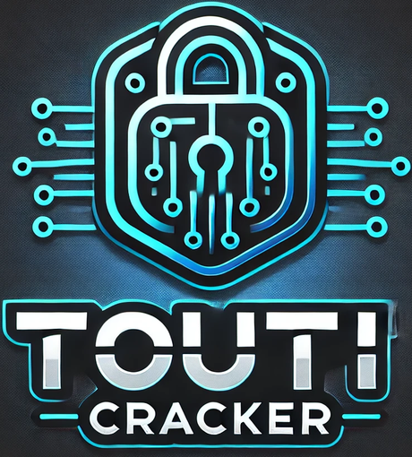

do not forget to star ⭐🌟⭐
## **Touti Cracker**



## 🇬🇧 English version :

do not forget to star ⭐🌟⭐

## 🚀 Touti Cracker v2.2.1


> **Important:** This tool is for **educational purposes only**. Any misuse is **strictly prohibited**. The developer holds no responsibility for unethical use.

---

### 🧠 What is Touti Cracker?

**Touti Cracker** is a cross-platform ethical hacking toolkit for educational purposes, featuring password cracking, WiFi auditing, and reverse shell payload generation to demonstrate system vulnerabilities. It also offers a fun and neon-styled UI

---

## 🆕 What's New in v2.2.1?

### [1] AUTOMATED PASSWORD CRACKING SUITE
 ----------------------------------------------------
####    Hashcat Automation:
     - Auto-downloads Hashcat v6.2.6 if missing
     - One-click SAM/SYSTEM hash extraction
     - Built-in benchmark mode (-O flag)

 ####   Intelligent Wordlist Generator:
     - Custom profiles (personal data-based)
     - Random mode (3-16 char length)
     - Saves to ~/Desktop/Touti_Cracker/passwordlist.txt

### [2] WI-FI PENTESTING TOOLKIT
 ----------------------------------------------------
####    Automated WPA/WPA2 Cracking:
     - Auto-detects wireless interfaces
     - Handshake capture with airodump-ng
     - Deauth attack integration (--deauth 10)
     - Seamless hashcat transition for .cap files

####    One-Click Attacks:
     $ ./ToutiCracker --wifi --bssid XX:XX:XX:XX:XX:XX
     - Automatic wordlist selection
     - Progress tracking with tqdm

### [3] ADVANCED SYSTEM TOOLS
 ----------------------------------------------------
 ####   Registry Exploitation:
     - SAM/SYSTEM hive backup (admin required)
     - Impacket-secretsdump integration
     - Local/NTLM hash extraction

####    Payload Factory:
     - Meterpreter reverse shell generator
     - Supports Windows/Linux targets
     - Listener auto-configuration

### [4] ENVIRONMENT MANAGEMENT
 ----------------------------------------------------
 ####   Auto-Dependency Installer:
     - Detects OS (Win/Lin/Mac)
     - Installs: Aircrack-ng, Metasploit, Hashcat
     - PIP requirements auto-setup

####    Privilege Management:
     - Admin check with auto-UAC bypass
     - AV detection (Windows Defender)


---

###  Core Features
-  **CrossPlatform**.
-  **Admin rights checker** with auto-restart.
-  **Auto Hashcat setup**.
-  Better Python version parsing and detection.
-  **Antivirus activity check**.
-  Hash extraction via `secretsdump` (Impacket).
-  **Dependencies fetched automatically**.
-  Enhanced **neon-styled terminal UI** using `rich`, `colorama`, `pyfiglet`.
-  Improved directory management for saved files.
-  Robust error handling (Permissions, FileNotFound, etc.).
-  Generate password lists (Custom or Random).
-  Backup SYSTEM & SAM registry hives.
-  Launch Hashcat automatically to crack hashes.
-  Auto-create directories for output files.

---

### ⚙️ Installation Guide

#### Prerequisites:

-  Python 3.8+
-  pip installed
-  7-Zip installed + added to system PATH (7-Zip is not require for MacOS and Linux)

#### Steps:

```bash
# 1. Clone the repository
$ git clone https://github.com/Touti-Sudo/Touti-Cracker.git

# 2. Move into the directory
$ cd Touti-Cracker

# 3. Install required Python packages
$ pip install -r requirements.txt

# 4. Run the script
$ python Touti\ Cracker-beta\ version-.py
```

>  On Windows, run the script as Administrator. On Linux/macOS, use `sudo` if needed.

---

###  Screenshots / Demo


---

###  Developer

Created by **Touti-Sudo** 

- GitHub: [https://github.com/Touti-Sudo](https://github.com/Touti-Sudo)

---

### ⚠️ Disclaimer

> Touti Cracker is intended only for ethical and educational purposes. Using it on systems without authorization is illegal and punishable by law. Please act responsibly.


---


## 🇫🇷 Version française :

n'oubliez pas de mettre une étoile ⭐🌟⭐

## 🚀 Touti Cracker v2.2.1


> **Important :** Cet outil est à but **strictement éducatif**. Toute mauvaise utilisation est **formellement interdite**. Le développeur décline toute responsabilité en cas d'usage non éthique.

---

### 🧠 Qu'est-ce que Touti Cracker ?

**Touti Cracker** est une boîte à outils de piratage éthique multiplateforme à vocation pédagogique, proposant le craquage de mots de passe, l'audit Wi-Fi et la génération de charges utiles de shell inversé pour démontrer les vulnérabilités du système. Elle propose également une interface utilisateur ludique et au style néon.

---

## 🆕 Quoi de neuf dans la v2.2.1 ?

 ### [1] SUITE AUTOMATISÉE DE CRACKAGE
 ----------------------------------------------------
 ####   Automatisation Hashcat:
     - Télécharge Hashcat v6.2.6 si absent
     - Extraction de hash SAM/SYSTEM en un clic
     - Mode benchmark intégré (-O)

####    Générateur Intelligent:
     - Profils personnalisés (basés sur données cibles)
     - Mode aléatoire (3-16 caractères)
     - Sauvegarde dans ~/Desktop/Touti_Cracker/passwordlist.txt

### [2] OUTIL WI-FI PENTEST
 ----------------------------------------------------
 ####   Crackage WPA/WPA2 Automatisé:
     - Détection auto des interfaces
     - Capture handshake avec airodump-ng
     - Attaque de déauth intégrée (--deauth 10)
     - Transition transparente vers hashcat

####    Attaques en Un Clic:
     $ ./ToutiCracker --wifi --bssid XX:XX:XX:XX:XX:XX
     - Sélection auto de wordlist
     - Suivi de progression avec tqdm

 ### [3] OUTILS SYSTÈME AVANCÉS
 ----------------------------------------------------
 ####   Exploitation de Registre:
     - Backup SAM/SYSTEM (admin requis)
     - Intégration impacket-secretsdump
     - Extraction de hash locaux/NTLM

####    Générateur de Payloads:
     - Reverse shell Meterpreter
     - Support Windows/Linux
     - Configuration auto de l'écouteur

 ### [4] GESTION D'ENVIRONNEMENT
 ----------------------------------------------------
####   Installateur Auto:
     - Détection OS (Win/Lin/Mac)
     - Installe: Aircrack-ng, Metasploit, Hashcat
     - Configuration auto des requirements PIP

 ####   Gestion de Privilèges:
     - Vérification admin + bypass UAC
     - Détection antivirus (Windows Defender)
     - Génération de logs propres

---

###  Fonctionnalités principales

-  **Multiplateforme**.
-  **Vérificateur des droits d'administrateur** avec redémarrage automatique.
-  **Configuration automatique de Hashcat**.
-  Meilleure analyse et détection des versions Python.
-  **Vérification de l'activité antivirus**.
-  Extraction de hachage via `secretsdump` (Impacket).
-  **Récupération automatique des dépendances**.
-  **Interface utilisateur de terminal néon** améliorée avec `rich`, `colorama`, `pyfiglet`.
-  Gestion améliorée des répertoires pour les fichiers enregistrés.
-  Gestion robuste des erreurs (autorisations, fichier introuvable, etc.).
-  Génération de listes de mots de passe (personnalisées ou aléatoires).
-  Sauvegarde des ruches de registre SYSTEM et SAM.
-  Lancez Hashcat automatiquement pour déchiffrer les hachages.
-  Créez automatiquement des répertoires pour les fichiers de sortie.

---

### ⚙️ Guide d'installation

#### Prérequis :

-  Python 3.8+
-  pip installé
-  7-Zip installé et ajouté au PATH système (non requis pour MacOS et Linux)

#### Étapes :

```bash
# 1. Cloner le dépôt
$ git clone https://github.com/Touti-Sudo/Touti-Cracker.git

# 2. Accéder au dossier
$ cd Touti-Cracker

# 3. Installer les dépendances Python
$ pip install -r requirements.txt

# 4. Lancer le script
$ python Touti\ Cracker-beta\ version-.py
```

> ⚠️ Sous Windows, exécute le script en tant qu'administrateur. Sous Linux/macOS, utiliser `sudo` si nécessaire.

---

###  Captures d'écran / Démo


---

###  Développeur

Créé par **Touti-Sudo** 

- GitHub : [https://github.com/Touti-Sudo](https://github.com/Touti-Sudo)

---

### ⚠️ Avertissement

> Touti Cracker est conçu uniquement pour des usages éthiques et pédagogiques. L'utiliser sur des systèmes sans autorisation est illégal et puni par la loi. Merci d'agir de manière responsable.
