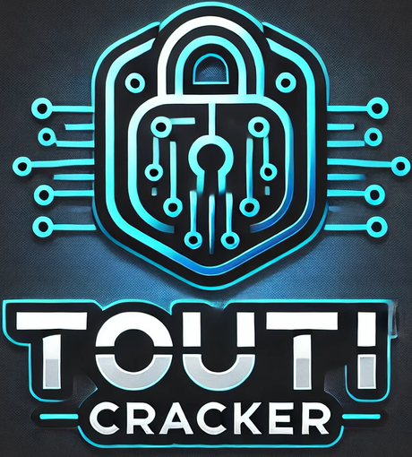

do not forget to star ⭐🌟⭐
## **Touti Cracker**

<div align="center">



  [](https://opensource.org/licenses/MIT)

[](https://github.com/Touti-Sudo/Touti-Cracker/issues)
[](https://github.com/Touti-Sudo/Touti-Cracker/issues)

  [](https://github.com/Bloul-Mohamed/gazachat_app/graphs/contributors)
  [](https://github.com/Touti-Sudo/Touti-Cracker/network/members)
  [](https://github.com/Touti-Sudo/Touti-Cracker/stargazers)

  [](https://github.com/Touti-Sudo/Touti-Cracker/releases)
</div>

## 🇬🇧 English version :

do not forget to star ⭐🌟⭐

# 🚀 Touti Cracker v2.2.3


>[!WARNING]
 This tool is for **educational purposes only**. Any misuse is **strictly prohibited**. The developer holds no responsibility for unethical use.

---

## 🧠 What is Touti Cracker?

**Touti Cracker** is a cross-platform ethical hacking toolkit for educational purposes, featuring password cracking, WiFi auditing, and reverse shell payload generation to demonstrate system vulnerabilities. It also offers a fun and neon-styled UI

---

## 🆕 What's New in v2.2.3?

### [1] New features
 ----------------------------------------------------
- A special script reverse shell (local only)

- Capable of creating reverse shell payload generation and Initially achieved low detection rates across multiple antivirus engines during internal testing (for educational purposes)"

### [2] Bug Fixes & Stability Improvements
 ----------------------------------------------------
- Prepared the codebase for easier future updates and contributions

- Improved error handling for missing files, permissions, and interruptions

- Resolved platform‑specific issues (Mac / Linux compatibility)

- Prepared the script for easier troubleshooting and future extensions
---

## 🛠️ Core Features
     -  CrossPlatform.
     -  Admin rights checker with auto-restart.
     -  Auto Hashcat setup.
     -  Better Python version parsing and detection.
     -  Antivirus activity check.
     -  Hash extraction via `secretsdump` (Impacket).
     -  Dependencies fetched automatically.
     -  Enhanced neon-styled terminal UI using `rich`, `colorama`, `pyfiglet`.
     -  Improved directory management for saved files.
     -  Robust error handling (Permissions, FileNotFound, etc.).
     -  Generate password lists (Custom or Random).
     -  Backup SYSTEM & SAM registry hives.
     -  Launch Hashcat automatically to crack hashes.
     -  Auto-create directories for output files.
     -  New reverse shell script 

---

## ⚙️ Installation Guide

#### Prerequisites:

-  Python 3.8+
-  pip installed
-  7-Zip installed + added to system PATH (Windows only): [Website](https://www.7-zip.org/)
- Chocolatey (Windows only): [see documentation for installation guide.](https://docs.chocolatey.org/en-us/)

#### Steps:

```bash
# 1. Clone the repository
$ git clone https://github.com/Touti-Sudo/Touti-Cracker.git

# 2. Move into the directory
$ cd Touti-Cracker
$ cd main

# 3. Install required Python packages
$ pip install -r requirements.txt

# 4. Run the script
$ python main.py
```
> [!NOTE]
>  On Windows, run the script as Administrator. On Linux/macOS, use `sudo` if needed.

> [!WARNING]
> Please disable your antivirus software for proper installation and operation.


-  Please ensure that Metasploit is in the path.


- Please ensure that Chocolatey and 7-Zip are properly installed.

---

## 📱 Screenshots / Demo


---

## 👨‍💻 Developer


Created by **Touti-Sudo** 

- GitHub: [https://github.com/Touti-Sudo](https://github.com/Touti-Sudo)

---

> [!WARNING]
 Touti Cracker is intended only for ethical and educational purposes. Using it on systems without authorization is illegal and punishable by law. Please act responsibly.

> [!IMPORTANT]
ToutiCracker is currently in **beta**. We are working on improving features, fixing bugs, and enhancing user experience. Your feedback is invaluable!


## 🤝 Contributing

We welcome contributions from the community!

### How to Contribute

1. **Fork** the repository
2. **Create** a feature branch (`git checkout -b feature/cool-feature`)
3. **Commit** your changes (`git commit -m 'Add cool feature'`)
4. **Push** to the branch (`git push origin feature/cool-feature`)
5. **Open** a Pull Request

### 🐛 Found a Bug?

If you find a bug or any issue, please [open an issue](https://github.com/Touti-Sudo/Touti-Cracker/issues/new) with:
- Description of the problem
- Steps to reproduce
- Expected vs actual behavior
- Screenshots (if possible)

### 💡 Feature Requests

Have an idea a new feature? We'd love to hear it! [Open a feature request](https://github.com/Touti-Sudo/Touti-Cracker/issues/) and let's discuss about it !

## 📄 License
This project is licensed under the MIT License - see the [LICENSE](LICENSE) file for details.

---
## 🇫🇷 Version française :

n'oubliez pas de mettre une étoile ⭐🌟⭐

## 🚀 Touti Cracker v2.2.3


>[!WARNING]
> Cet outil est destiné uniquement à des fins éducatives. Toute utilisation abusive est strictement interdite. Le développeur décline toute responsabilité en cas d’usage non éthique.

---

### 🧠 Qu'est-ce que Touti Cracker ?

**Touti Cracker** est une boîte à outils de piratage éthique multiplateforme à vocation pédagogique, proposant le craquage de mots de passe, l'audit Wi-Fi et la génération de charges utiles de shell inversé pour démontrer les vulnérabilités du système. Elle propose également une interface utilisateur ludique et au style néon.

---

## 🆕 Nouveautés de la version v2.2.3

### [1] Nouvelles fonctionnalités
----------------------------------------------------

- Ajout d'un script spécial de reverse shell (local uniquement).

- Ajout de la génération de charges utiles (payloads) de reverse shell. Lors des tests internes, les payloads ont initialement obtenu un faible taux de détection sur plusieurs moteurs antivirus (à des fins éducatives).

### [2] Corrections de bugs et améliorations de la stabilité
----------------------------------------------------

- Préparation de la base de code pour faciliter les futures mises à jour et les contributions.

- Amélioration de la gestion des erreurs liées aux fichiers manquants, aux autorisations et aux interruptions.

- Résolution de problèmes spécifiques aux plateformes (compatibilité Mac / Linux).

- Préparation du script pour faciliter le dépannage et les futures extensions.

---

### 🛠️ Fonctionnalités principales

-  **Multiplateforme**.
-  **Vérificateur des droits d'administrateur** avec redémarrage automatique.
-  **Configuration automatique de Hashcat**.
-  Meilleure analyse et détection des versions Python.
-  **Vérification de l'activité antivirus**.
-  Extraction de hachage via `secretsdump` (Impacket).
-  **Récupération automatique des dépendances**.
-  **Interface utilisateur de terminal néon** améliorée avec `rich`, `colorama`, `pyfiglet`.
-  Gestion améliorée des répertoires pour les fichiers enregistrés.
-  Gestion robuste des erreurs (autorisations, fichier introuvable, etc.).
-  Génération de listes de mots de passe (personnalisées ou aléatoires).
-  Sauvegarde des ruches de registre SYSTEM et SAM.
-  Lancez Hashcat automatiquement pour déchiffrer les hachages.
-  Créez automatiquement des répertoires pour les fichiers de sortie.
-  Un script reverse shell avancer

---

### ⚙️ Guide d'installation

#### Prérequis :

-  Python 3.8+
-  pip installé
- 7-Zip installé et ajouté au PATH système (Windows uniquement) : [Site web](https://www.7-zip.org/)
- Chocolatey (Windows uniquement) : [Consultez la documentation pour obtenir le guide d'installation.](https://docs.chocolatey.org/en-us/)

#### Étapes :

```bash
# 1. Cloner le dépôt
$ git clone https://github.com/Touti-Sudo/Touti-Cracker.git

# 2. Accéder au dossier
$ cd Touti-Cracker
$ cd main

# 3. Installer les dépendances Python
$ pip install -r requirements.txt

# 4. Lancer le script
$ python main.py
```

> [!NOTE]
>  Sous Windows, exécutez le script en tant qu’administrateur. Sous Linux/macOS, utilisez sudo si nécessaire.

> [!WARNING]
> Veuillez désactiver votre antivirus pour une installation et un fonctionnement corrects

- Assurez-vous que Metasploit est présent dans le PATH

- Assurez-vous que Chocolatey et 7-Zip sont correctement installés
---

### 📱 Captures d'écran / Démo


---

### 👨‍💻 Développeur


Créé par **Touti-Sudo** 

- GitHub : [https://github.com/Touti-Sudo](https://github.com/Touti-Sudo)

---


>[!WARNING]
> Touti Cracker est conçu uniquement pour des usages éthiques et pédagogiques. L'utiliser sur des systèmes sans autorisation est illégal et puni par la loi. Merci d'agir de manière responsable.

>[!IMPORTANT]
> Touti Cracker est actuellement en version bêta. Nous travaillons activement à l’amélioration des fonctionnalités, à la correction des bugs et à l’optimisation de l’expérience utilisateur. Vos retours sont très importants !

## 🤝 Contribuer

Les contributions sont les bienvenues !

### Comment contribuer

1. **Fork** le dépôt

2. **Créer** une branche (git checkout -b feature/super-fonctionnalite)

3. **Commit** les changements (git commit -m 'Ajout d’une super fonctionnalité')

4. **Push** la branche (git push origin feature/super-fonctionnalite)

5. **Ouvrir** une Pull Request

### 🐛 Bug trouvé ?

Si vous trouvez un bug, veuillez ouvrir une issue avec :

- Description du problème

- Étapes pour reproduire

- Comportement attendu vs réel

- Captures d’écran (si possible)

### 💡 Suggestions de fonctionnalités

Vous avez une idée ? [Ouvrez une demande de fonctionnalité](https://github.com/Touti-Sudo/Touti-Cracker/issues/) et discutons-en !

## 📄 Licence

Ce projet est sous licence MIT – voir le fichier LICENSE pour plus de détails.
